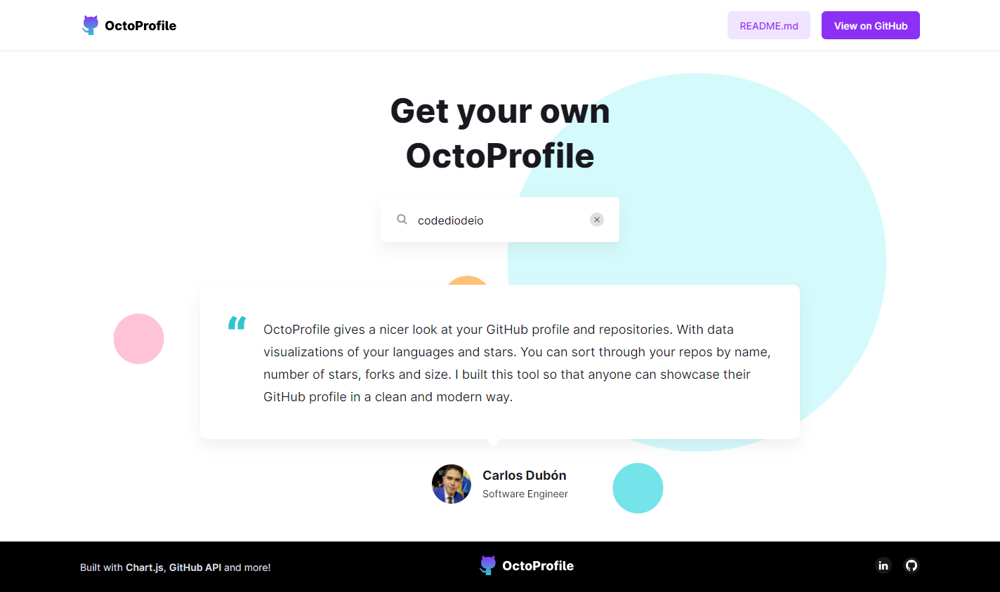
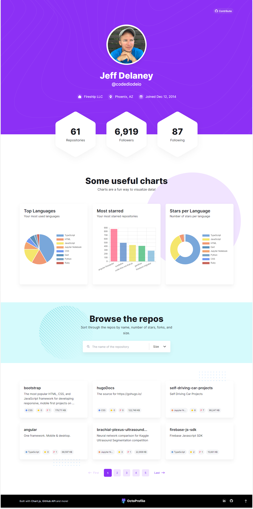

# :octocat: OctoProfile

<strong>A nicer look at GitHub profiles.</strong>

Technology stack used:

<a href="https://carlos-dubon.github.io/octoprofile/" target="_blank">https://carlos-dubon.github.io/octoprofile/</a>

OctoProfile gives a **nicer look** at your GitHub profile and repositories. With **data visualizations** of your languages and stars. You can **sort through your repos** by name, number of stars, forks and size. I built this tool so that anyone can showcase their GitHub profile in a clean and modern way.

